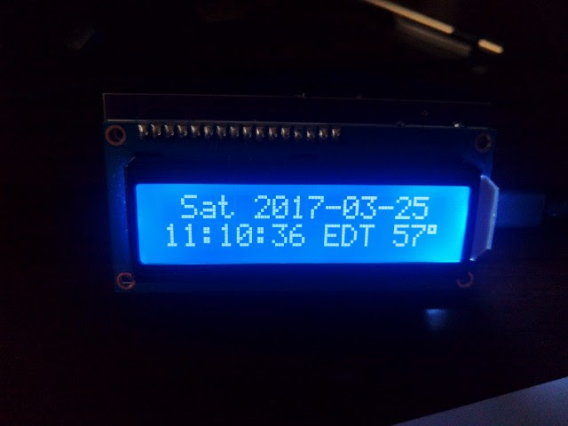

# Photon Clock

This repository contains all of the software and schematics required to build
and flash a 16x2 smart clock driven by a [Particle Photon](https://store.particle.io/#photon).

## Parts list

1. PCB (see below for details)
1. [HD44780 assembled LCD](https://www.adafruit.com/products/1447)
1. Trim potentiometer (should come with the HD44780)
1. [TMP36 temperature sensor](https://www.adafruit.com/products/165) (not needed if using external weather)
1. [Particle Photon with headers](https://store.particle.io/#photon)
1. ~50-60ohm THT resistor
1. 10nF capacitor

## PCB details

Eagle 8 format schematics are included in the "eagle" directory in this
repository. If you wish to order a PCB, you will need to use a service that
supports Eagle .brd files, or generate your own Gerbers.

I recommend [OSH Park](https://www.oshpark.com/) for ease of use, cost, quality,
and their cool purple soldermask.

## Building the software

Before proceeding, you will need a registered, Wi-Fi configured Photon.

See instructions in the `code/build.sh` script to build and flash the Photon.

If you wish to use the built-in temperature sensor, you will need to comment out
the following line:

`#define EXTERNAL_TEMP true`

## External integrations

In order for the clock to set the correct timezone, you will need to configure
the `timezone.json` external integration in the `integrations` directory in the
Particle console.

In order for the clock to collect external weather, you will need to configure
the `weather.json` external integration.

**Please note** that you must supply your own API key or none of the
integrations will work.

To configure each custom integration:
1. Go to [https://console.particle.io/integrations](https://console.particle.io/integrations) in your web browser
1. Click "NEW INTEGRATION"
1. Click "Webhook", then "Custom JSON"
1. Paste the contents of the relevant `.json` file from the `integrations`
   directory
1. Edit the URL section to include your API key
1. Click "CREATE WEBHOOK"

